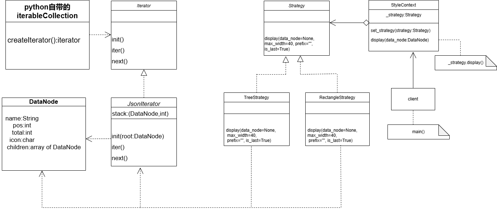
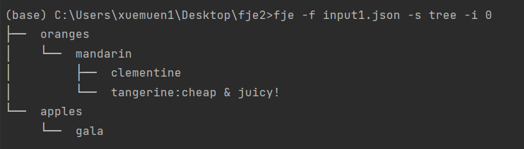
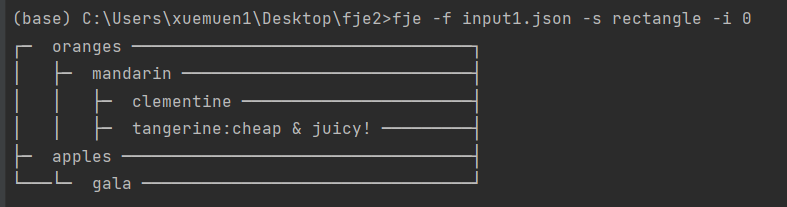
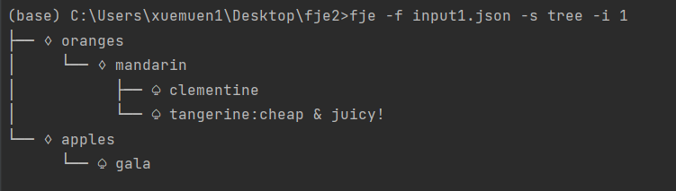
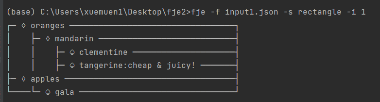
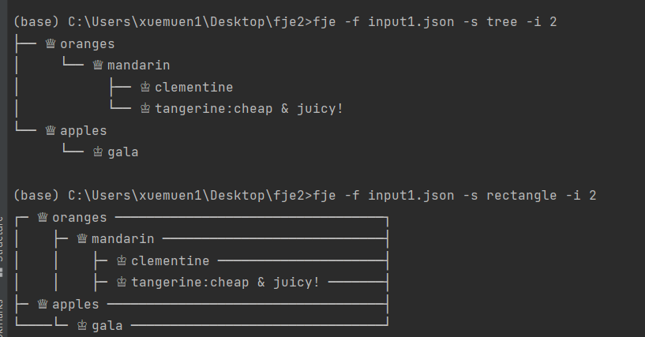
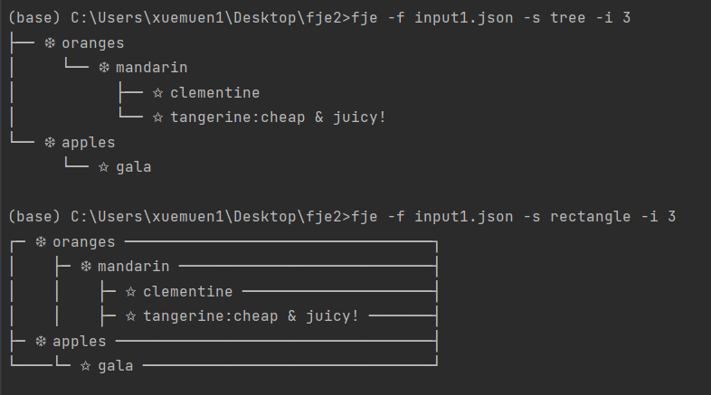
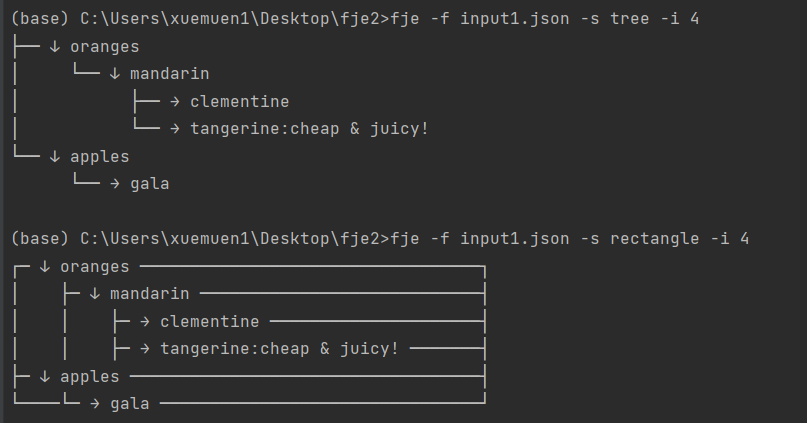

# 设计文档

(内容和README一样)

## 类图
## 类图



**注：** python的迭代器模式和其他语言不同，比较特殊。总所周知Python有很完善的封装，所以使用for循环的时候python内部的iteratorCollection就会产生iterator，不需要我们自己实现iteratorCollection部分。

我们只需要实现抽象iterator和具体的类JSONiterator
```python
class Iterator:
    def __init__(self):
        pass

    def __iter__(self):
        pass

    def __next__(self):
        pass


class JSONIterator(Iterator):
    def __init__(self, root):
        self.stack = [(root, -1)]  # 一个栈，一个数据含有两个元素（节点，再数组的位置）

    def __iter__(self):
        return self

    def __next__(self):
        while self.stack:
            data_node, index = self.stack.pop()
            if index == -1:  # 新加入的节点
                self.stack.append((data_node, 0))
                return data_node
            elif index < len(data_node.children):
                self.stack.append((data_node, index + 1))
                child = data_node.children[index]
                self.stack.append((child, -1))
                return child
        raise StopIteration

```

然后for循环调用：
```python
for i, child in enumerate(data_node.children):
```

即可实现迭代器模式，因此：**类图里面迭代器模式的iteratorCollection会和一般设计模式不太一样**


#### 设计模式
本项目通过迭代器模式和策略模式实现了对复杂 JSON 数据结构的灵活遍历和展示。迭代器模式提供了一种高效的遍历机制，而策略模式则允许动态选择不同的数据处理策略，例如解析、过滤或转换，从而实现更高度的定制化和复用性。

这里通过迭代器模式为便利节点的Children数组提供了方便，策略模式则给出了输出treeStyle和rectangleStyle的具体方法。这样使得输出风格的实现上高度定制化且有很高的复用性，不需要改原来的代码就可以实现一个新的输出风格。


#### 策略模式
策略模式建议将不同的算法或行为抽象成单独的策略类，而不是将它们整合到原始类中。需要使用特定策略的客户端将选择并传递适当的策略对象给上下文（Context），这使得上下文能够根据需求调用特定策略的方法，而无需关心具体实现细节。

Strategy 类是一个抽象基类（Abstract Base Class），定义了所有具体策略类（如 TreeStrategy 和 RectangleStrategy）必须实现的接口或方法。在这里，Strategy 类声明了 display 方法，这是所有具体策略类必须提供的方法。

具体策略类（TreeStrategy 和 RectangleStrategy）继承自 Strategy 类，并实现了 display 方法，但具体实现方式各不相同，分别用于树形和矩形风格的展示效果。

策略模式通过将不同的显示策略抽象成单独的策略类（如TreeStrategy和RectangleStrategy），使得每种策略可以独立地进行扩展和修改，而不影响到其他部分的代码。在上下文类（StyleContext）中，根据需要设置具体的策略对象，然后调用策略对象的方法来展示数据节点的信息。这种设计允许程序在运行时动态地选择和切换不同的策略，从而达到不同的显示效果，而不需要修改现有的数据节点类（DataNode）或上下文类（StyleContext）的代码

通过定义抽象的 Strategy 类，代码遵循了开闭原则（Open-Closed Principle），即对扩展开放、对修改关闭。这样做的好处是，如果需要添加新的展示风格，只需创建新的具体策略类并继承 Strategy，然后在需要的时候将其传递给 StyleContext，而无需修改现有的策略类或上下文类的代码。

总之，Strategy 类充当了所有具体策略类的抽象接口，确保它们都实现了相同的方法，同时使得代码结构更加清晰和可扩展。

作用：

策略模式通过定义一系列算法，并将每个算法封装到具有共同接口的独立类中，使得它们可以互相替换。这种方式使得算法可以独立于使用它们的客户而变化，从而使得系统更加灵活，并且能够简化算法的变更和扩展。

通过策略模式，客户端可以在运行时选择算法的具体实现，而不是在编译时硬编码这些选择。这种灵活性使得策略模式在需要动态改变算法时特别有用，或者当一个系统有多个类似的算法，但它们有不同的实现时，可以避免使用大量的条件语句。

总结来说，策略模式的主要作用是通过将算法封装成对象，使得可以根据需要选择并应用不同的算法，从而提高代码的可维护性、灵活性和可扩展性。


**迭代器模式**
迭代器模式提供一种方法来访问聚合对象中的元素，而不暴露其底层表示。它通过提供统一的接口，使得可以按顺序访问集合对象的元素。
迭代器模式需要设计迭代器类和容器类。作业中我将DataNode设为容器类，DataNode类属性有DataNode 列表(child)作为集合， 会在渲染时遍历该列表。 
DataNode 通过 __iter__ 方法返回一个 JSONIterator 对象。  

迭代器类是专门设计的JSONIterator 类，提供一个获取集合元素的基本方法 Iter，以及顺序遍历要用到的next 函数。如果要其他的遍历方式可以使用不同迭代器类。
JSONIterator 维护一个栈来记录当前遍历的结点和状态。

作用：

迭代器模式旨在提供一种统一的方式来顺序访问聚合对象的元素，而无需暴露其内部结构。它通过定义迭代器接口和具体实现，使得客户端可以轻松地遍历不同类型的聚合对象，从而降低耦合度并增加灵活性。

迭代器模式还可以帮助简化客户端代码，因为它将遍历集合的责任交给了迭代器对象，客户端只需关注业务逻辑而无需编写复杂的遍历代码。这样可以提高代码的可读性和可维护性，同时使得算法的实现更加集中和易于测试。


运行结果：
4张fje基本要求的运行图片：







选做部分：



